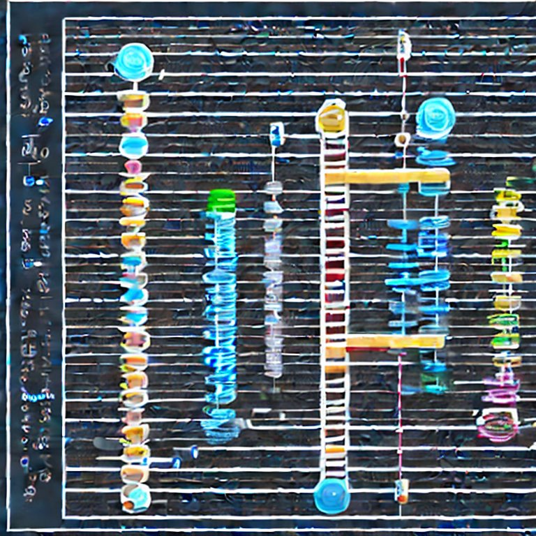

# Homorepeat Extraction




## Purpose
- Extract aminoacid homorepeats (several aminoacids in a row) from protein sequences using large databases. 
- Gather miscellaneous data such as the ratio of homorepeats given the aminoacid type or the secondary structure of the homorepeats. 

## Installation
- Clone this repository using git
	1. Click on the "Code" button and copy the URL of the repository.

	2. Open your terminal or Git Bash if you're on Windows.

	3. Navigate to the directory where you want to clone the repository using the cd command.

	4. Run the following command to clone the repository:

	```console
	git clone <repository URL>
	```

	5. Replace <repository URL> with the URL of the repository you copied in step 2.

	6. Press enter and Git will clone the repository to your local machine.
- Download the repository as a zip file and access its contents

Make sure the requirements are satisfied!

## Usage

The usage has been designed to be simple: open the terminal and run a Python script with two arguments.


```console
python main.py my_homorepeat_threshold my_path_to_pdb
```

- **Homorepeat threshold (integer)**: The minimum number of aminoacids in a row to be considered a homorepeat. For example, AAAAT contains a "A" homorepeat if the threshold is 4, but not if it is 5.
- **path_to_pdb (string)**: Path to the directory containing .pdb files.


## Output

- `files_with_homorepeats.txt`: list of pdb files that present homorepeats 
- `data` folder containing:
	- `homorepeat information`: if an homorepeat is found, annotate aminoacid, homorepeat length, position and secondary structure percentage ([%alpha, %beta, %coil]) --> e.g. GLU 4 714-717 [0.0, 75.0, 25.0] means that a homorepeat of consisting of 4 GLU aminoacids was found at positions 714-715-716-717 with a 75% beta structure and a 25% alpha structure.
	
	- `homorepeat analysis`:  annotate the ratio of found homorepeats out of the total number of chains. 
	- `dihedral data`: annotate dihedral angles for each folder and draw a psi-phi plot


## Requirements
- biopython==1.78
- contourpy==1.0.5
- cycler==0.11.0
- fonttools==4.37.4
- kiwisolver==1.4.4
- matplotlib==3.6.0
- numpy==1.23.3
- packaging==21.3
- Pillow==9.2.0
- pyparsing==3.0.9
- python-dateutil==2.8.2
- six==1.16.0
- DSSP (for e.g. Ubuntu follow these [steps](https://zoomadmin.com/HowToInstall/UbuntuPackage/dssp))

